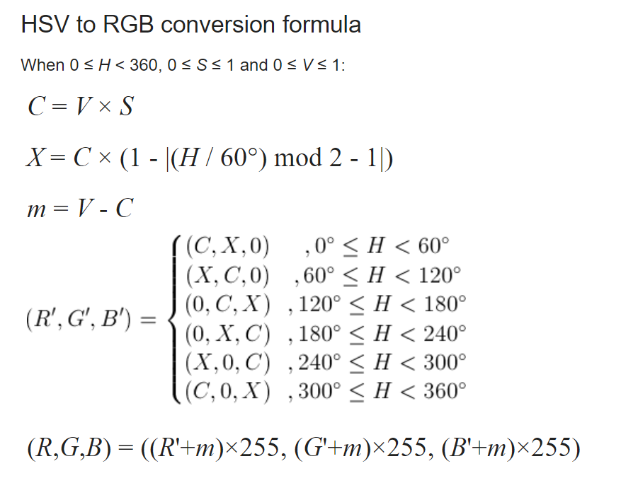
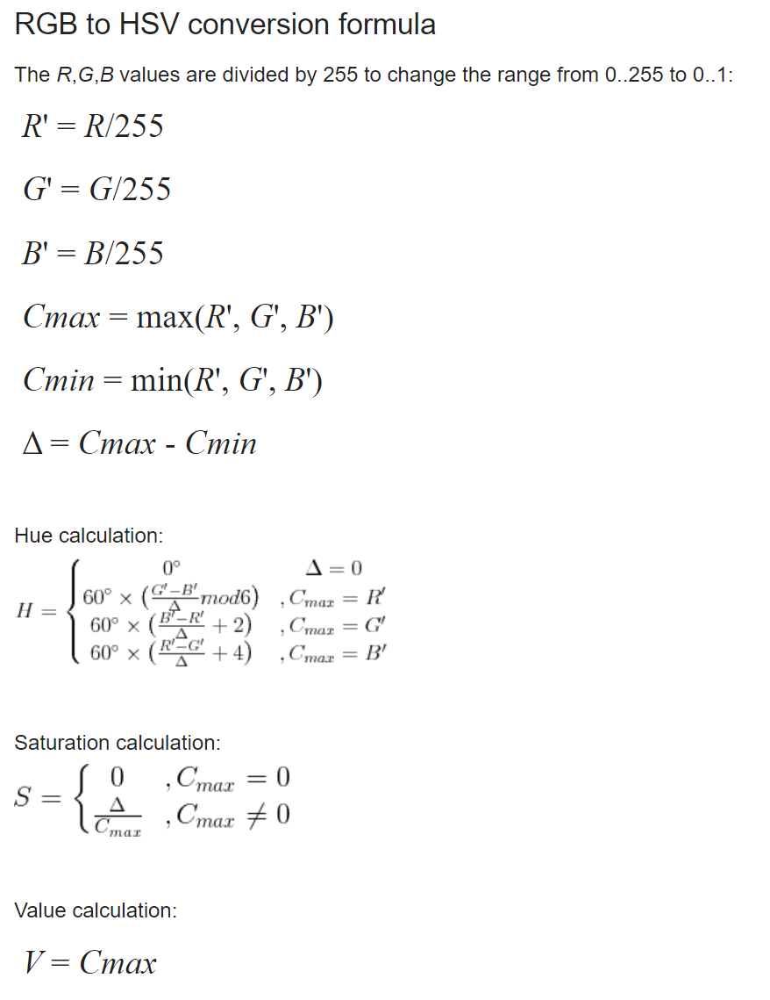

# `dominant-colors-smart`

**A fast NodeJS library written in C++ to obtain the dominant colors of an image in a meaningful way to get usable results.**

To process images, I used the fantastic [stb_image library](https://github.com/nothings/stb).\
To find peaks in my diagrams, I adapted [the code](https://github.com/claydergc/find-peaks) from Clayder Gonzalez, which is also an adaptation of the [original code](https://fr.mathworks.com/matlabcentral/fileexchange/25500-peakfinder-x0-sel-thresh-extrema-includeendpoints-interpolate) from Matlab.\
Lastly, to turn my C++ code into a Node library, I used the [node-addon-api](https://github.com/nodejs/node-addon-api), or napi for short.

## The "meaningful way" for usable results

What do I mean by "meaningful way for usable results" ?\
To better understand, here's a comparison of the analysis of the image below by a fairly widely used library: dominant-colors versus the analysis of my library.


I'll explain how I do it later in this readme, but it's not rocket science.

## How to use

### Installation

You can install `dominant-colors-smart` using `npm`:

``` bash
npm install -g dominant-colors-smart
```

### Usage

I recommend you take a look at the example.js file at the root of this project for more examples and to better understand the use of certain parameters, even if the library is really simple to use.

``` JS
var dominantColorsSmart = require('dominant-colors-smart');

/*
    Array getDominantColors(String imagePath, Integer dominantCount, Boolean enliven = true);

    Returns an array of strings containing the hexadecimal codes of the dominantCount colors of
    the image given in the imagePath argument.

    The enliven option allows you to increase the saturation and value of the image's HSV values
    by 50% to obtain brighter colors. It is enabled by default.
*/

dominantColorsSmall = dominantColorsSmart.getDominantColors("images/small.png", 3)

console.log(dominantColorsSmall)
/* Ouput : ['#ff04', '#3c719c', '#950eef'] */
```

## How does it work?

### General functioning of the algorithm
The algorithm is quite simple. Here are the steps the image goes through to obtain its dominant colors:
- The image is resized if it exceeds 65536 pixels to speed up its analysis.
- Each pixel's RGB value is recovered and transferred as an HSV value to obtain the Hue value for transposing the colors onto a chromatic circle in the correct order.
- A diagram is then made of each pixel's Hue value, and a local maximum search algorithm creates a table of the diagram's peaks corresponding to the colors.
- Finally, the values are sent in order of appearance, and the algorithm tries to find values that are sufficiently different from each other to make up the final selection.

### Enliven option

During the retrieval of all pixel values, each Hue value is associated with a saturation S and a value V. The Hue value is usually a float, but in order to reduce color diversity the algorithm cast Hue as an integer, and thus sometimes (quite often in reality on a fairly large image) two values with the same Hue but different S and V values appear. The algorithm averages the S and V values for each same Hue.
The enliven option simply increases the S and V values by 50% once the algorithm has finished recovering all the pixels.

### Value conversions

This part isn't necessarily very interesting, but as there are different approaches to converting RGB values to HSV and vice versa, I'm putting here the formulas I've personally used.

<div>
  
  
</div>
